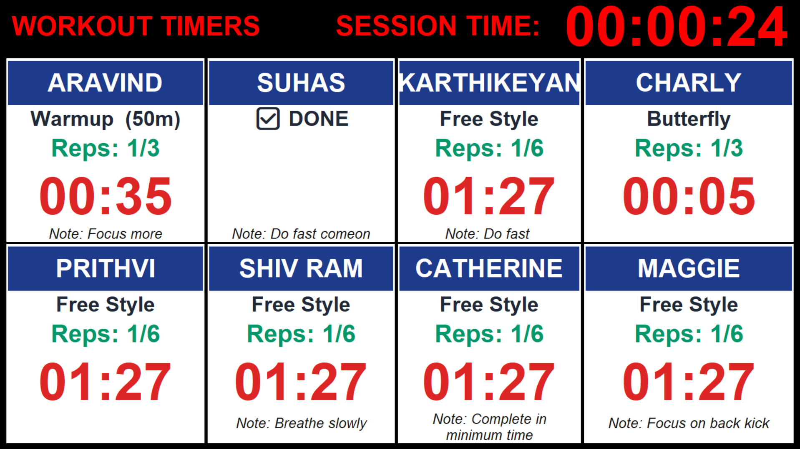
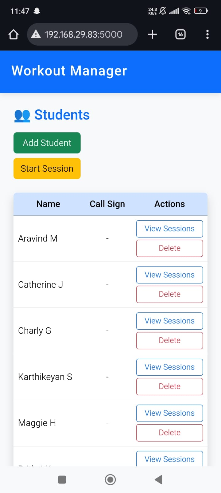
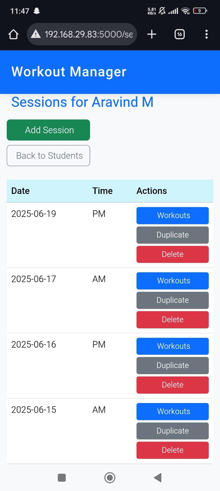
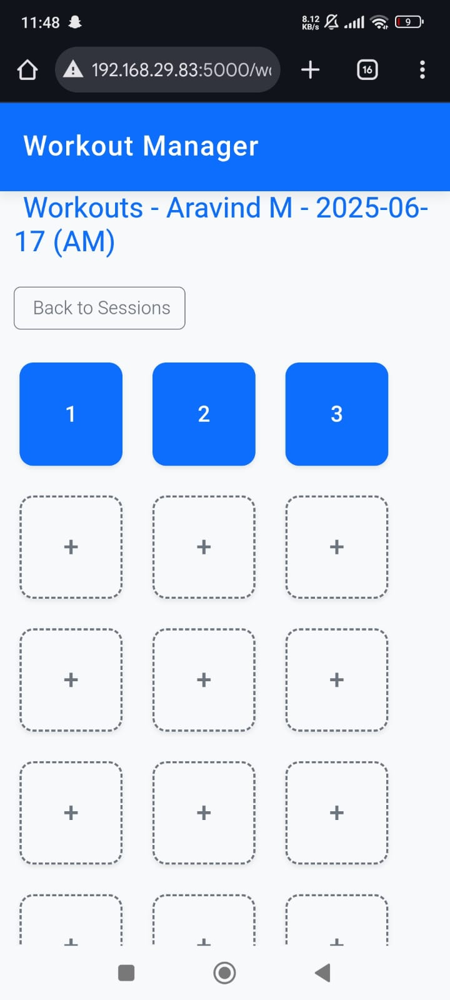

# 🏊 Student Workout Tracker

A full-featured Flask application to manage and track swim workouts for students, with a responsive web interface and fullscreen timer using `tkinter`.

## 📌 Features

- 👨‍🎓 Student and Session Management
- 🏋️‍♂️ Add/Edit/Delete Workouts per Session
- 🧠 Critical Velocity (CV) Mode with per-rep durations
- ⏱ Fullscreen Live Workout Timer for up to 20 students
- 📱 Mobile-friendly UI with Bootstrap
- 💾 MySQL Database Integration
- 🎯 Repetition-wise and Session-wise Tracking

## 🗃 Database Schema Overview



### Tables

- `students(id, first_name, last_name, age, gender, ...)`
- `sessions(id, date, coach_name, notes, ...)`
- `workouts(id, session_id, student_id, sequence_number, workout_type, distance, duration, repetitions, critical_velocity, notes)`
- `rep_durations(id, workout_id, rep_index, duration)`

## 🚀 Tech Stack

| Layer         | Tech                          |
|---------------|-------------------------------|
| Backend       | Python, Flask                 |
| Frontend      | HTML, Jinja2, Bootstrap 5     |
| Timer Module  | Python `tkinter`              |
| Database      | MySQL (`mysql.connector`)     |

## 🖥 Screenshots

<p align="center">
  
  
  
</p>
<p align="center">
  <b>Home</b> &nbsp;&nbsp;&nbsp;&nbsp;
  <b>Workout Timer</b> &nbsp;&nbsp;&nbsp;&nbsp;
  <b>Details Page</b>
</p>


## 🧪 How to Run

1. **Clone the Repo**
   ```bash
   git clone https://github.com/yourusername/workout-tracker.git
   cd workout-tracker
